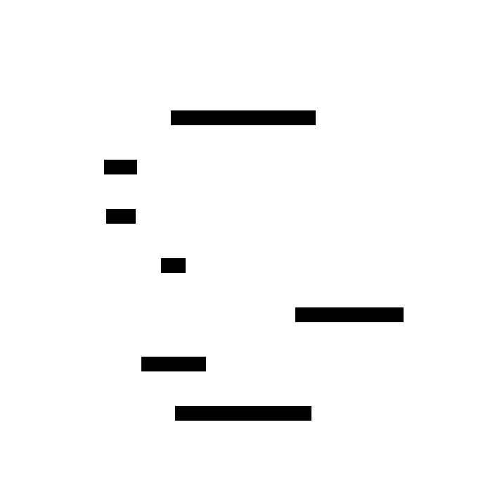

# 简单理解 `rust` 异步编程

## 前置知识

`rust` 的异步编程在语法上只有`async`和`await`，看起来理解起来还是比较困难，新手常见的错误和疑惑如下：

- 代码没有运行

    ```rust
    tokio::time::sleep(std::time::Duration::from_millis(100));
    ```

    `rust`作为编译运行的课代表，上述代码编译器当然发出如下警告：

    ```shell
    note: futures do nothing unless you `.await` or poll them
    ```

- 为什么不能调用

    ```rust
    fn main() {
        tokio::time::sleep(std::time::Duration::from_millis(100)).await;
    }
    ```

    根据错误信息：

    ```shell
    `await` is only allowed inside `async` functions and blocks
    ```

    异步代码需要一个异步运行时才能执行，常见的异步运行时是`tokio`。

- 异步函数是什么

    ```rust
    async fn hello(name: &'static str) {
        println!("hello, {name}!");
    }

    #[tokio::main]
    async fn main() {
        let f = hello("world");
        f.await
    }
    ```

    从上可以看出，`hello`这个异步函数返回这里实际上是：

    ```rust
    let f: impl Future<Output = ()> = hello("world")
    ```

    所以接下来要看`Future`到底是什么。

## `Future`

`Future`是一个`trait`，如下所示：

```rust
pub trait Future {
    type Output;
    fn poll(self: Pin<&mut Self>, cx: &mut Context) -> Poll<Self::Output>;
}
```

`Future`的`poll`函数返回的是一个`Poll`，其定义如下：

```rust
pub enum Poll<T> {
    Ready(T),
    Pending,
}
```

从上可以看出，`Future` 表示可以被轮询，即`poll`，当它被 `poll` 的时候，返回的是 `Pending`（未完续待） 或 `Ready`（完成状态，返回结果）。
所以 `rust` 的异步本质是状态机，如下图所示：


- Pending：状态机中间状态
- Ready(T): 状态机完成状态，返回值为T，即`Output`

下面来看这个状态机是如何运行，为方便起见，这里使用`tokio`运行时。

```rust
use std::{future::Future, task::Poll};

struct Hello;

impl Future for Hello {
    type Output=();

    fn poll(self: std::pin::Pin<&mut Self>, cx: &mut std::task::Context<'_>) -> std::task::Poll<Self::Output> {
        println!("Ready: poll()");
        Poll::Pending
    }
}

#[tokio::main]
async fn main() {
    let f = Hello;
    println!("Before ready().await");
    f.await;
    println!("After ready().await");
}
```

这个程序会一直运行，但只会打印一次`Ready: poll()`。其运行时序图如下：



想要下次还能重新进入，就需要一个唤醒者，看`Context`这个魔法器了。
下面的程序会在状态机运行5次：

```rust
struct Hello {
    num: u8,
}

impl Future for Hello {
    type Output=String;

    fn poll(mut self: std::pin::Pin<&mut Self>, cx: &mut std::task::Context<'_>) -> std::task::Poll<Self::Output> {
        if self.num < 5 {
            println!("enter Hello poll, number: {}", self.num);
            self.num += 1;
            cx.waker().wake_by_ref();
            Poll::Pending
        } else {
            Poll::Ready(format!("number is: {}", self.num))
        }
    }
}

#[tokio::main]
async fn main() {
    let f = Hello {num: 0};
    let r = f.await;
    println!("r={}", r);
}
```

看到这里，你可能有一个疑问，我能不能自己调用`poll`行不行？
看下面的组合器例子就知道了。

### `Future` 组合器

`Future` 组合器是指将多个 `Future` 连接组合起来，类似迭代器，示范如下：

```rust
use std::{future::Future, pin::Pin, task::Poll};


struct InnerFuture {
    num: u8
}

impl Future for InnerFuture {
    type Output=String;

    fn poll(mut self: std::pin::Pin<&mut Self>, cx: &mut std::task::Context<'_>) -> std::task::Poll<Self::Output> {
        if self.num < 5 {
            println!("enter InnerFuture poll, number: {}", self.num);
            self.num += 1;
            cx.waker().wake_by_ref();
            Poll::Pending
        } else {
            Poll::Ready(format!("number is: {}", self.num))
        }
    }
}

struct OuterFuture<T> {
    inner: Pin<Box<T>>
}

impl <T> Future for OuterFuture<T> where T: Future<Output = String> {
    type Output = usize;

    fn poll(mut self: std::pin::Pin<&mut Self>, cx: &mut std::task::Context<'_>) -> std::task::Poll<Self::Output> {
        let inner = Pin::new(&mut self.inner);
        match inner.poll(cx) {
            Poll::Ready(v) => Poll::Ready(v.len()),
            Poll::Pending => Poll::Pending
        }
    }
}

#[tokio::main]
async fn main() {
    let f = OuterFuture {
        inner: Box::pin(InnerFuture {num: 0})
    };
    let r = f.await;
    println!("r: {r}");
}
```

上述只是为了演示，实际上`Future`组合在第三方库已经提供了（如futures库中的FutureExt），这里又出现了一个新概念`Pin`，观察`poll`函数原型要可以看出，第一个参数要求为`Pin`。

## `Pin`

`Pin`的定义如下：

```rust
#[derive(Copy, Clone)]
pub struct Pin<Ptr> {
    pub __pointer: Ptr,
}
```

单从定义来看，`Pin`就是对原始数据类型的一个包装，那为什么需要这个包装呢？`Pin` 存在是为了解决一个特定的问题：自指类型，即包含有指向了自身的指针的类型。

所以从这个角度来说，`Rust` 类型都可以分两类：

- 可以被安全地在内存中移动的类型，绝大部分都是这种类型
- 自指类型，即不能被安全地在内存中移动的类型

上面示范中先创建了一个 `Pin`，另外一种更简便的方法是使用`as_mut()`，如下：

```rust
// let inner = Pin::new(&mut self.inner);
match self.inner.as_mut().poll(cx) {
    Poll::Ready(v) => Poll::Ready(v.len()),
    Poll::Pending => Poll::Pending
}
```

## 参考文献

- [how I finally understood async/await in Rust](https://hegdenu.net/posts/understanding-async-await-1/)
- [Async/Await](https://os.phil-opp.com/async-await/)
- [Pin and suffering](https://fasterthanli.me/articles/pin-and-suffering)
- [Pin, Unpin, and why Rust needs them](https://blog.adamchalmers.com/pin-unpin/)
